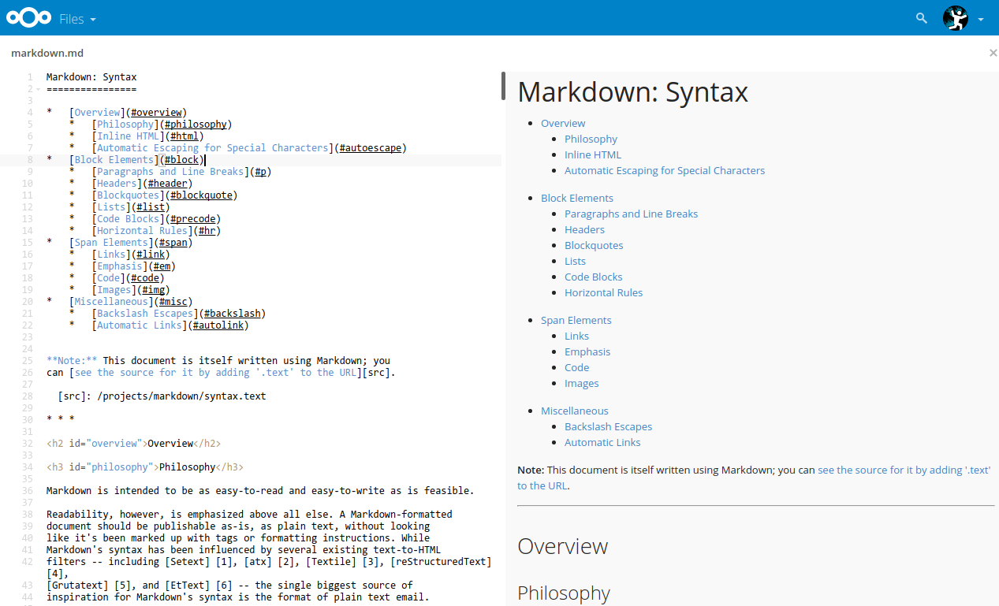
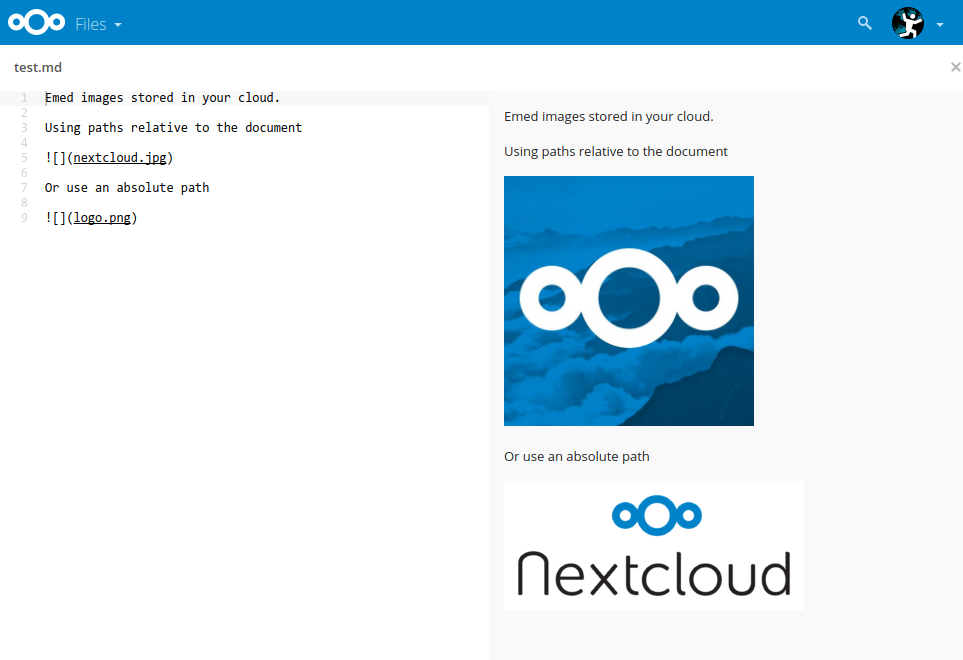
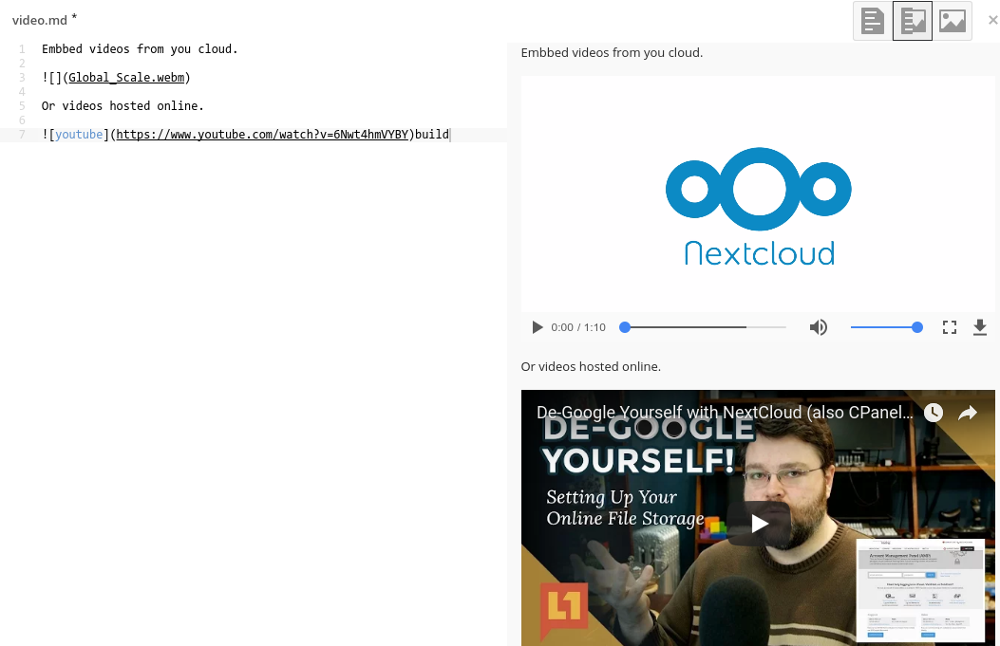
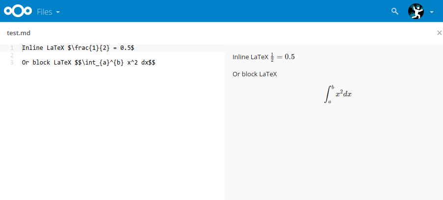
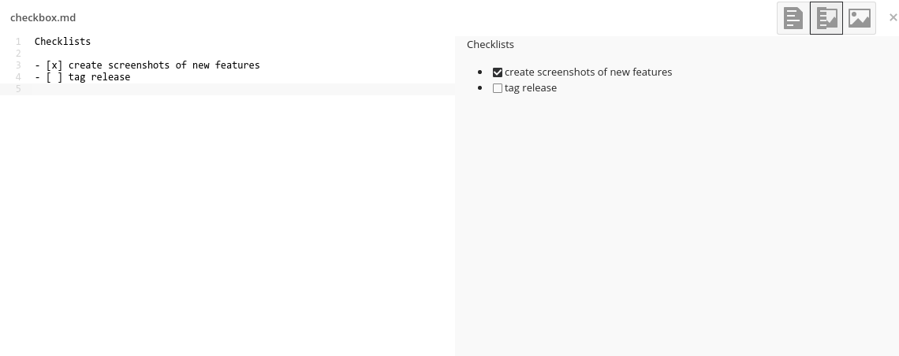
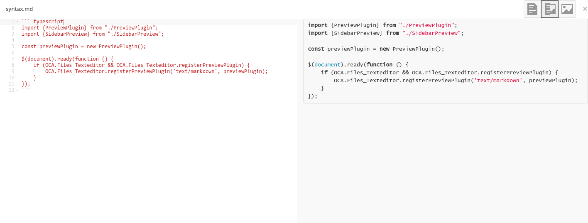
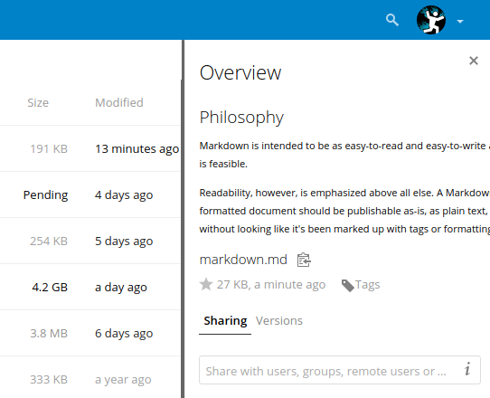

Nextcloud Markdown Editor
=================

Extends the text editor in Nextcloud with a live preview for markdown files

Usage
---

Starting with Nextcloud 17, the "Plain text editor" app has been replaced with the [Text](github.com/nextcloud/text/),
in order to use this app you'll first need to install both the "Plain text editor" and this app.

You can than either disable the Text app to use the "Plain text editor" app by default,
or use the three dot menu and choose "Edit in plain text editor". 

Features
---

### Embed images and videos stored on your Nextcloud

### Use LaTeX to add math to your documents

### Keep track of tasks with checkbox lists

### Syntax highlighting for your code

### Create graph using [mermaid.js](https://github.com/knsv/mermaid)

### Fully rendered previews in the sidebar
 

Requirements
---

This requires Nextcloud and the Text Editor app to be installed from Nextcloud 10 or higher.

Installation
---

- You can get the app from the [Nextcloud app store](https://apps.nextcloud.com/apps/files_markdown)
or download the latest release from [github](https://github.com/icewind1991/files_markdown/releases).

If you're installing from git, you'll need to build the project by running `make` in the app directory.

Usage
---

To use the markdown editor, simply open a file with a `.md` or `.markdown` extention.

Development
---

This app is written in typescript and requires nodejs and npm to build.

To build the project run `make` from the app directory.

For development you can automatically build the project every time
the source changes by running `make watch`.
