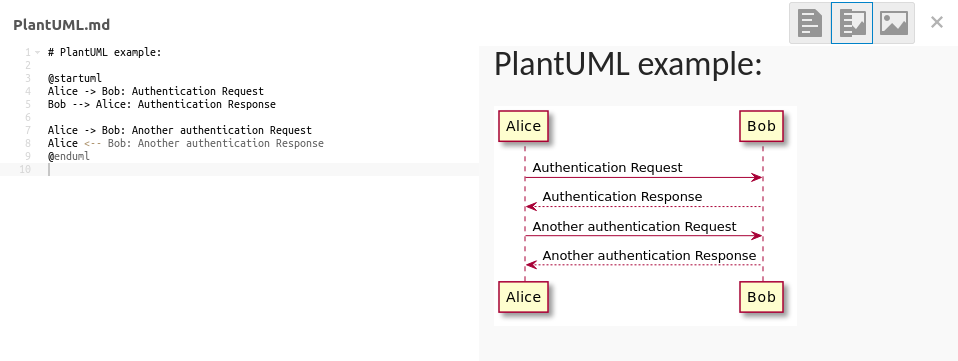

Nextcloud Markdown Editor
=================

Extends Nextcloud text editing with a live preview for markdown files

Usage
---

Starting with Nextcloud 17, the **[Text](github.com/nextcloud/text/)** app replaced the **[Plain text editor](https://apps.nextcloud.com/apps/files_texteditor)** app. In order to use ***Markdown Editor***, you must install and enable both it and **[Plain text editor](https://apps.nextcloud.com/apps/files_texteditor)**.

To use ***Markdown Editor***, simply open any file with an `.md` or `.markdown` extension.

Behaviors
---

### SCENARIO ONE

_WITH **MARKDOWN EDITOR**, **PLAIN TEXT EDITOR**, AND **TEXT** APPS ALL ENABLED:_

The **[Text](github.com/nextcloud/text/)** app will still, by default, open `.txt`, `.md`, and `.markdown` files. However, you can override that behavior by clicking the three-dot dropdown menu for any `.txt`, `.md`, or `.markdown` file and choosing “Edit in plain text editor.” Using this method, ***Markdown Editor*** will open `.md`, and `.markdown` files while ***Plain text editor*** will open `.txt` files.

### SCENARIO TWO

_WITH **MARKDOWN EDITOR** AND **PLAIN TEXT EDITOR** ENABLED, BUT **TEXT** DISABLED:_

***Markdown Editor*** will open `.md`, and `.markdown` files while ***Plain text editor*** will open `.txt` files. It’s unnecessary to use the three-dot dropdown menu to invoke either.

>_Be aware: Disabling the **Text** app will also disable (but not delete) any **Rich Workspace** notes you may have created. These are the styled notes that appear above and before file lists. Re-enabling **Text** makes them visible again._

Features
---

### Embed images and videos stored on your Nextcloud

### Use LaTeX to add math to your documents

### Keep track of tasks with checkbox lists

### Syntax highlighting for your code

### Create graph using [mermaid.js](https://github.com/knsv/mermaid)

### Creating diagrams using a simple, intuitive language [plantuml](https://github.com/plantuml/plantuml)

### Fully rendered previews in the sidebar
 

Requirements
---

This app requires the [Plain text editor](https://apps.nextcloud.com/apps/files_texteditor) app to be installed on Nextcloud 10 or higher.

Installation
---

- Get ***Markdown Editor*** from the [Nextcloud app store](https://apps.nextcloud.com/apps/files_markdown)
or download the latest release from [github](https://github.com/icewind1991/files_markdown/releases).

- If you’re installing from git, build the project by running `make` in Nextcloud’s app directory.

Development
---

***Markdown Editor*** is written in [typescript](https://www.typescriptlang.org/). It requires [nodejs](https://nodejs.org/en/) and [npm](https://www.npmjs.com/) to build.

For development you can automatically build the project every time the source changes by running `make watch`.
